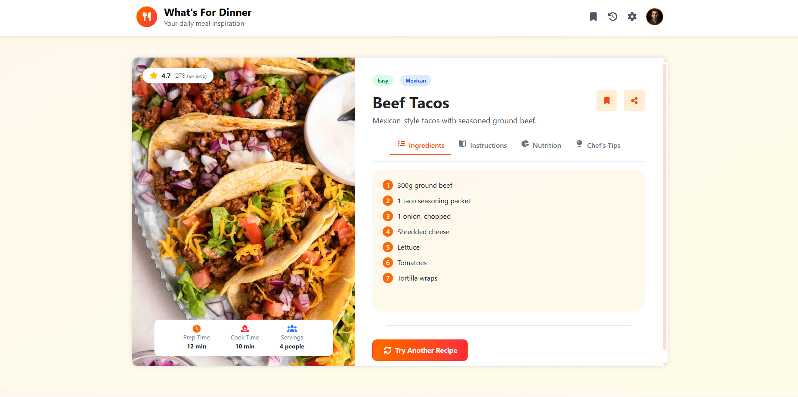

# 🍽️ **What's For Dinner?**

### Your Daily Source of Delicious Meal Inspiration

🔗 **Live Demo:** [https://what-is-for-dinner.netlify.app/]

---

## ✨ **Overview**

**What's For Dinner** is a beautiful and easy‑to‑use recipe discovery app that helps users explore new meals every day. With clean visuals, fast navigation, and rich recipe details, the app makes meal planning simple and fun.

Whether you're looking for a quick dinner idea, exploring new cuisines, or just curious, this app gives you fresh inspiration with every click.

---

## ⭐ **Features**

* 🍜 *Discover delicious recipes* with images and ratings.
* 📖 *Full recipe details:* ingredients, steps, prep time, cook time, servings.
* 🧪 *Nutrition facts* for health‑conscious users.
* 🔄 **Try Another Recipe** — get a new suggestion instantly.

---

## 🛠️ **Technologies Used**

**HTML5**

**CSS3**

**Bootstrap 5**

**JavaScript** 

---

## 📸 **Screenshots**

---

## 📬 Contact

**Your Name**
Email: [rannaahmeddd1@gmail.com](mailto:rannaahmeddd1@gmail.com)
GitHub: [https://github.com/RanaAhm3d](https://github.com/RanaAhm3d)
